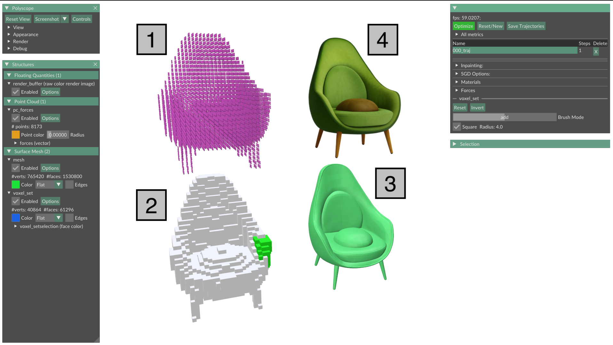
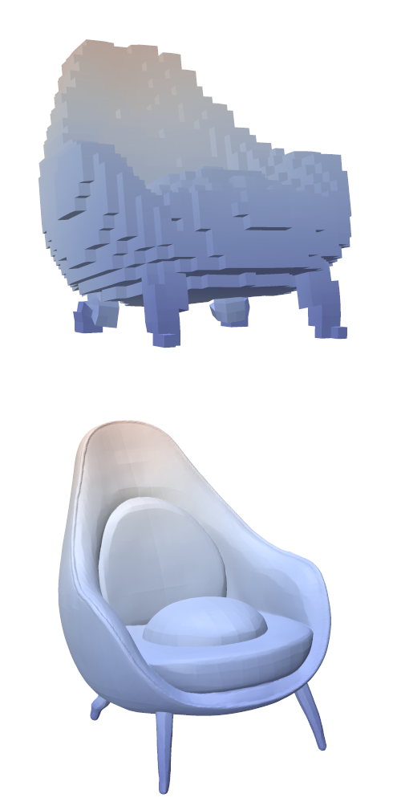

# PhysiOpt: Physics-Driven Shape Optimization for 3D Generative Models


Official code release for the paper:  
**PhysiOpt: Physics-Driven Shape Optimization for 3D Generative Models**  
SIGGRAPH Asia 2025  
[Xiao Sean Zhan<sup>*</sup>](https://seanzhan.com/), [Clément Jambon<sup>*</sup>](https://clementjambon.github.io/), [Evan Thompson](https://evanthompson.site/about), [Kenney Ng](https://research.ibm.com/people/kenney-ng), [Mina Konaković Luković](https://people.csail.mit.edu/mina/)  
<sup>*</sup> Equal contribution  

[[Project page]](https://physiopt.github.io/) · [[Paper]](https://drive.google.com/file/d/1NAFBoqL0SCAuW1Tz60zJOfqegjbv0wCm/view?usp=sharing)


## 🌟 Overview

**PhysiOpt** is a differentiable physics optimizer that improves the physical integrity of 3D generative model outputs by operating directly in the latent space of shape priors. It builds on FEM to incorporate user-specified loads and constraints while enabling fast and semantic-preserving optimization to retain the creative capabilities of generative modeling. 

This repository provides code for installing and optimizing with PhysiOpt.

## 📚 Table of Contents

- [🛠 Installation](#-installation)
- [🚀 Optimization with TRELLIS](#-optimization-with-trellis)
- [🪑 Optimization with DeepSDF](#-optimization-with-deepsdf)
- [✨ Main Features](#-main-features)

## 🛠 Installation

### Requirements

PhysiOpt was tested under the following system configuration:
* Operating System: Linux (Ubuntu 20.04 or later)
* Python: 3.10 (via conda)
* PyTorch: 2.4.0
* CUDA: 11.8
* Hardware: NVIDIA GPU with at least 16GB of VRAM (24GB recommended), e.g. RTX 4090 or better

### Cloning the repository and its submodules

Start by cloning this repository and its submodules:
```bash
git clone --recursive https://github.com/physiopt/physiopt.git
cd physiopt
```

> [!WARNING]
> Make sure that cuda is visible via `PATH`, `LD_LIBRARY_PATH`, and `CUDA_HOME` environment variables:
> ```bash
> export PATH=[YOUR CUDA 11.8 PATH]/bin:$PATH
> export LD_LIBRARY_PATH=[YOUR CUDA 11.8 PATH]/lib64:$LD_LIBRARY_PATH
> export CUDA_HOME=[YOUR CUDA 11.8 PATH]
> ```

### TRELLIS dependencies

This will clone a custom version of [TRELLIS](https://github.com/physiopt/trellis-physiopt).
Since we found the [default TRELLIS installation script](https://github.com/physiopt/trellis-physiopt/blob/main/setup.sh) to be somewhat fragile, we provide an installation script that we tested to work reliably (for Pytorch 2.4.0 and CUDA 11.8):
```bash
./setup_trellis.sh
```
> [!WARNING]
> Make sure to run this script from the root PhysiOpt directory.

> [!WARNING]
> Make sure you have a significant amount of RAM available (at least 16GB, 32GB recommended) as flash attention compilation is extremely memory intensive!

> [!NOTE]
> This may take a while (several hours) as it needs to compile [FlashAttention](https://github.com/ROCm/flash-attention) from scratch.

This will automatically create a new conda environment named `physiopt`.
After installation, if it isn't already activated, activate it with:
```bash
conda activate physiopt
```

### Additional dependencies

Finally, install the additional dependencies for PhysiOpt:
```bash
pip install -r requirements.txt
```

> [!NOTE]
> This will install a custom version of [Polyscope](https://polyscope.run/). This version is crucial to run PhysiOpt.

> [!NOTE]
> If you're using a laptop with an intel chipset, you may need to specify the following environment variable to avoid errors related to OpenGL (when running the viewer):
> ```bash
> export __NV_PRIME_RENDER_OFFLOAD=1 
> export __GLX_VENDOR_LIBRARY_NAME=nvidia
> ```

### Testing the installation

To test your installation, you can run the TRELLIS-based 3D generation viewer using:
```bash
python scripts/sample_viewer.py --text [or --image]
```
 
## 🚀 Optimization with TRELLIS

### Generating 3D shapes

You can generate shapes either using a text prompt or an image.

To do so, you can use the sample viewer using
```bash
python scripts/sample_viewer.py --text [or --image]
```
For images, simply drag-and-drop the image. 
The corresponding image should appear in the GUI if it was successfully loaded. Note that the first time you drag-and-drop an image, generation will automatically start, which may take some time.
In both cases, you can save the generated 3D models using the dedicated `Save` button. 
Note that you need to provide a folder. 
For example, `out/blablabla` will create:
```
out/blablabla
  # Gaussian Splats
  - sample_00.ply
  - sample_01.ply
  - ...
  # A turntable video of the reconstructed GS
  - sample_gs_00.mp4
  - sample_gs_01.mp4
  - ....
  # The (structured) latents used for everything
  - slat_00.pt
  - slat_01.pt
  - ...
```
In practice, the viewer only saves one sample (see the other sampling strategies below for more advanced options).

> [!NOTE]
> You can also generate samples without the viewer using `scripts/sample.py` as described below.
>
> For text, run:
> ```bash
> python scripts/sample.py --text "[YOUR_PROMPT]" --out_folder out/[TARGET_FOLDER] [--n_samples 5] [--mesh]
> ```
> where `--n_samples` specifies the number of samples to generate, and `--mesh` optionally exports an `.obj`.
>
> For images, run:
> ```bash
> python scripts/sample.py --image [IMAGE_PATH] --out_folder out/[TARGET_FOLDER] [--n_samples 5] [--mesh]
> ```

### Optimizing with the viewer

To run the viewer on a pre-generated `slat` file, run:
```bash
python scripts/viewer_trellis.py --input [SLAT].pt
```
Once open, you should be able to load other files by simply dragging and dropping them!

## 🪑 Optimization with DeepSDF

To use DeepSDF, first download the snapshots from [there](https://drive.google.com/drive/folders/11g8nsoCnvEXbh-dAnTYJFCh1Dvp-ggBc?usp=sharing) and place them in the folder of your choice (e.g., `data/DeepSDF/chairs`, etc). Then, run the corresponding viewer using:
```bash
python scripts/viewer_deepsdf.py --exp data/DeepSDF/examples/chairs --ui_config ui_config_deepsdf.yaml
```
You can replace `chairs` with `tables` or `lamps` to optimize other categories.
`ui_config_deepsdf.yaml` rearranges the GUI to be more suitable for DeepSDF optimization.

Once in the viewer, you can switch between pre-trained shapes using the `shape_idx` field.

## ✨ Main Features

### Overview

When starting the viewer (either TRELLIS or DeepSDF), you should see a GUI similar to the one below:


Above:
1. Are the nodal forces applied to the shape.
2. Allows you to add an additional force over a selected region. To select, hold `alt` and click on the highlighted region. It should turn blue when selected. If you want to reset the selection, simply select `Reset` in the `voxel_set` dropdown. You can change the radius of the selection by using the mouse scroll wheel and holding `alt`. You can change the force direction and magnitude in the `Forces` section. When modifying forces, you should see the arrows of `1` update accordingly.
3. Shows the 3D mesh from the generative model.
4. (TRELLIS only!) Displays the Gaussian splat produced by TRELLIS.

You can start the optimization by clicking on the green `Optimize` button at the top.
During/after optimization, you can see both the deformed optimization voxels (top) and the corresponding deformed mesh (bottom).



After optimization, use the `step` slider to visualize the optimization trajectory.

> [!NOTE]
> For Trellis, you should see bumps in the optimization loss every 25 iterations. This is due to the inpainting/reprojection step described in Section 5.3 and Appendix B.4 of the paper. You can disable or modify the inpainting interval in the `Inpainting` dropdown.

### Exporting/loading trajectories

You can export the current optimization trajectories in the editor using the `Save Trajectories` button.
This will save the intermediate optimization steps in a `.traj` file.
You can then load these trajectories back by simply dragging-and-dropping the `.traj` file into the viewer.

### Advanced Features

If you need advanced features (e.g., custom boundary conditions, modified volume regularization, etc), set `dev_mode` to `True` in your UI configuration file (`ui_config.yaml` by default).
After restarting the viewer, you should see new specialized dropdowns.

## 📄 Citation

If you find this work useful, please consider citing:

```bibtex
@inproceedings{physiopt,
  title     = {PhysiOpt: Physics-Driven Shape Optimization for 3D Generative Models},
  author    = {Zhan, Xiao and Jambon, Cl{\'e}ment and Thompson, Evan and Ng, Kenney and Konakovi{\'c} Lukovi{\'c}, Mina},
  booktitle = {ACM SIGGRAPH Asia 2025 Conference Proceedings},
  year      = {2025},
  note      = {To appear in ACM SIGGRAPH Asia 2025 Conference Proceedings.}
}
```

## 📜 License
This work is licensed under the MIT License. See the [LICENSE](LICENSE) file for details.
